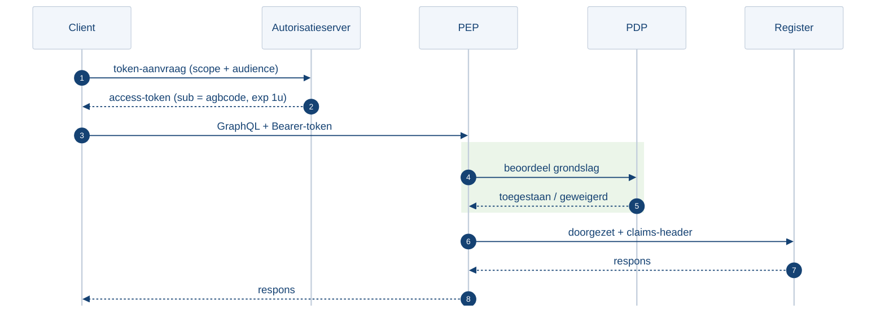
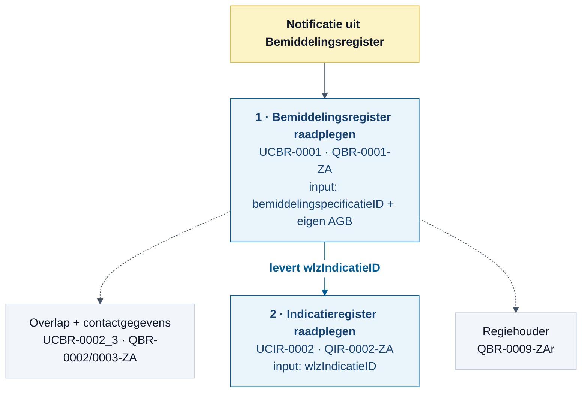

## 3. Implementatiestappen

Deelname aan het iWlz-netwerkmodel vereist de onderstaande stappen, in de aanbevolen volgorde.

### 3.1 Controleer of je systeem netwerkmodel-proof is

Vergelijk je huidige estafette-implementatie met het netwerkmodel. Pas je software waar nodig aan. Gebruik daarvoor concreet:

1. **Gegevens (veld-voor-veld):** de mapping **"Mapping Bemiddelingsregister - AW33"** bij [iWlz Bemiddelingsregister 1](https://www.istandaarden.nl/domain/iwlz/specificaties/release-1). Hierin staat hoe de gegevens uit het Indicatie- en Bemiddelingsregister overeenkomen met de AW33.
2. **Informatiemodel (concepten):** vergelijk het [estafette-informatiemodel iWlz 2.4](https://informatiemodel.istandaarden.nl/informatiemodel/iwlz/estafette/2.4/) dat je nu in productie hebt met de netwerkmodel-registers ([Bemiddelingsregister 1](https://informatiemodel.istandaarden.nl/informatiemodel/iwlz/netwerk/bemiddelingsregister-1/), [Indicatieregister](https://informatiemodel.istandaarden.nl/informatiemodel/iwlz/netwerk/indicatieregister-2/), [Leveringsregister 1](https://informatiemodel.istandaarden.nl/informatiemodel/iwlz/netwerk/leveringsregister-1/)). Het overzicht in §2.2 helpt bij de inhoudelijke verschillen.
3. **Proces en regels:** beoordeel of je procesafhandeling past bij het wegvallen van de estafette-volgorde en de retourberichten (§2.1 en §3.10).

### 3.2 Aansluiten bij VECOZO

Gebruik van het iWlz-netwerk vereist aansluiting bij VECOZO. De vereisten staan in [Aansluiten bij VECOZO](https://istandaarden.github.io/Afsprakenstelsel-iWlz/current/applicatie/diensten/toetreden/#2-aansluiten-bij-vecozo/) van het artikel Toetreden. Voor het aansluiten heb je onder andere een KvK-nummer, een AGB-code en een ondertekende aansluitovereenkomst (OVK) met VECOZO nodig. Ook moet de zorgorganisatie voldoen aan NEN 7510.

Softwareleveranciers en zorginkoopbemiddelaars hoeven niet zelf NEN 7510-gecertificeerd te zijn en hoeven geen eigen AGB-code aan te leveren; de zorgorganisatie die hun software gebruikt blijft verantwoordelijk.

Een organisatie die al via een OVK bij VECOZO is aangesloten, moet vooralsnog een nieuw systeemcertificaat aanvragen voor het iWlz-netwerk. Het bestaande systeemcertificaat kun je niet hergebruiken. De geregistreerde IP-adressen en de toestemmingsverklaring kun je mogelijk wel hergebruiken. Of hergebruik van het certificaat later toch mogelijk wordt, toetsen we nog. Let op: voor het iWlz-netwerk heb je een apart test- en productiecertificaat nodig. Ook meld je je resource-server-endpoints aan (zie §3.3 en §3.4).

### 3.3 Aansluiten op het iWlz-netwerk

Na aansluiting bij VECOZO sluit je aan op het iWlz-netwerk. De vereisten staan in [Aansluiten op het iWlz-netwerk](https://istandaarden.github.io/Afsprakenstelsel-iWlz/current/applicatie/diensten/toetreden/#3-aansluiten-op-het-iwlz-netwerk) van het artikel Toetreden. De technische aansluiting kent de volgende substappen:

1. Systeemcertificaten aanvragen bij VECOZO (voor zowel test- als productieomgeving).
2. Systeemcertificaten installeren.
3. IP-adressen vastleggen bij het systeemcertificaat in de VECOZO-portal.
4. Resource-server-endpoints aanmelden in het tijdelijk adresboek (zie §3.4).
5. Toestemmingsverklaring instellen (voor softwareleveranciers en zorginkoopbemiddelaars).

### 3.4 Aansluiten op het tijdelijk adresboek

Het adresboek bevat de endpoints die aangeven waar notificaties en meldingen naartoe moeten en waar informatie kan worden geraadpleegd. Omdat het zorgadresboek (Zorg-AB) nog niet beschikbaar is, is er een tijdelijk adresboek:

[github.com/iStandaarden/iWlz-adresboek-public](https://github.com/iStandaarden/iWlz-adresboek-public)

De softwareleverancier van de zorgaanbieder moet voor aansluiting op het Bemiddelingsregister notificatie-endpoints aanmelden. Zo weet bijvoorbeeld het zorgkantoor bij registratie van een Bemiddelingspecificatie (toewijzing) waar de notificatie naartoe moet. Zodra de softwareleverancier ook het Leveringsregister aansluit, levert hij ook de resource-endpoints en meldingen-endpoints voor het Leveringsregister aan.

**Wijze van aanmelden.** De publieke repo bevat geen self-serviceregistratie. De actuele adreslijst staat in een afgeschermde repo (`iWlz-adresboek-private`). Aanmelden en wijzigen gaat via de servicedesk iStandaarden:

- E-mail: [info@istandaarden.nl](mailto:info@istandaarden.nl)
- Contactpersonen: Dennis de Gouw en Remo van Rest
- Toegang tot de private repo vraag je aan met het bericht "Aanvraag toegang iWlz Adresboek private". Vermeld daarbij je organisatie en GitHub-account.

**Structuur van een adresboek-entry.** Elke `electronicService` heeft een `gegevensdienstId` volgens de conventie `[OrganisatieID]_[Functionaliteit]_[Omgeving]` (bijvoorbeeld `CIZ_INDICATIE_TST`), een `weergavenaam`, een `description` en drie endpoint-blokken:

- `authorizationEndpoint.authorizationEndpointuri` (de PEP, zie §3.5)
- `tokenEndpoint.tokenEndpointuri` (de autorisatieserver)
- `systeemrollen[]` met een `systeemrolcode` en een `resourceEndpoint.resourceEndpointuri` (de eigenlijke dienst)

```json
{ 
    "electronicServices": [ 
        { 
            "description": "TEST OMGEVING Voor het raadplegen van het Wlz Indicatieregister", 
            "gegevensdienstId": "CIZ_INDICATIE_TST", 
            "weergavenaam": "TEST OMGEVING - Wlz Indicatieregister", "authorizationEndpoint": { "authorizationEndpointuri": "https://<pep-url>/" }, 
            "tokenEndpoint": { "tokenEndpointuri": "https://<autorisatieserver-url>/" },
            "systeemrollen": [ 
                { "systeemrolcode": "Register", 
                "resourceEndpoint": { "resourceEndpointuri": "https://<graphql-endpoint>/" } 
                 } 
            ] 
        } 
    ] 
}
```
!!! info
    Registreer per AGB-code de relevante endpoints in het tijdelijk adresboek. Neem hiervoor contact op met iStandaarden.

### 3.5 Autorisatie inrichten

Voor notificeren, melden en raadplegen is autorisatie nodig. Je vraagt een access-token (JWT) aan bij de autorisatieserver met een authenticatiemiddel, een of meer scopes en een audience. De flow is OAuth 2.0 Client Credentials.


Figuur 2 - Autorisatie en raadplegen via de PEP

**Acteren namens de zorgaanbieder (AGB-actor).** Een softwareleverancier of intermediair handelt namens de zorgaanbieder via het actor-mechanisme. Een zorgaanbieder wordt geïdentificeerd met een AGB-code (een zorgkantoor met een UZOVI-code). In het access-token staat de zorgaanbieder daarom als `sub = agbcode:012345678`. Het token is maximaal één uur geldig. Voor meer informatie zie [nID netwerkstelsel, 3. Autoriseren](https://istandaarden.github.io/Afsprakenstelsel-iWlz/current/applicatie/nid_netwerkstelsel/#3-autoriseren).

**Scopes.** Een scope is opgebouwd uit het resource-type en de benodigde toegang. Voor de zorgaanbieder zijn dit de relevante scopes:

| **Doel** | **Scope** |
| --- | --- |
| Indicatieregister raadplegen | `registers/wlzindicatieregister/indicaties:read` |
| Bemiddelingsregister raadplegen | `registers/wlzbemiddelingsregister/bemiddelingen/bemiddeling:read` |
| Notificatie aan een zorgaanbieder | `organisaties/zorgaanbieder/notificaties/notificatie:create` |
| Melding aan een zorgaanbieder | `organisaties/zorgaanbieder/meldingen/melding:create` |

De specifieke scopes staan ook in de uitwisselprofielen: [Uitwisselprofiel Indicatie, §8.2](https://istandaarden.github.io/Afsprakenstelsel-iWlz/current/uitwisselprofiel/uitwisselprofiel_indicatie/#82-nid-netwerkstelsel-scopes) en [Uitwisselprofiel Bemiddeling, §8.2](https://istandaarden.github.io/Afsprakenstelsel-iWlz/current/uitwisselprofiel/uitwisselprofiel_bemiddeling/#82-nid-netwerkstelsel-scopes). Gebruik je een scope die niet is toegekend, dan krijg je "Access denied, invalid scope".

**Audience en PEP.** Je moet precies één audience opgeven, als geldige https-URL. De audience is de afgeschermde `resourceEndpointuri` van de resource-server, die alleen de Policy Enforcement Point (PEP) van die resource-server vertrouwt. Je raadpleegt het register dus nooit rechtstreeks: al het verkeer loopt via de PEP. De PEP valideert de grondslag (samen met de PDP) en zet het verzoek door naar de resource-server. De audience-URL herken je in het adresboek aan de tag `resourceEndpointuri`.

De PEP-endpoints zijn:

- Testomgeving: `https://tst-api.vecozo.nl/tst/netwerkmodel/v3/pep`
- Productieomgeving: `https://api.vecozo.nl/netwerkmodel/v3/pep`

### 3.6 Inrichten Notificeren en Melden

Het netwerkmodel ondersteunt het hele iWlz-ketenproces. Daarvoor moet een ketenpartij soms relevante informatie ontvangen. Zo komt de voortgang van de zorglevering niet in gevaar. Voor meer informatie zie [Notificeren en Melden](https://istandaarden.github.io/Afsprakenstelsel-iWlz/current/applicatie/diensten/notificeren-en-melden/). Notificeren en melden zijn technisch identiek opgebouwd als GraphQL-mutaties (`zendNotificatie` en `zendMelding`); het generieke schema staat in [iWlz-generiek](https://github.com/iStandaarden/iWlz-generiek).

#### 3.6.1 Notificaties ontvangen

Een notificatie wijst een deelnemer van het netwerkmodel op nieuwe of gewijzigde informatie die relevant is voor die deelnemer. Aan de hand van de inhoud van de notificatie weet je wat er speelt en doe je een gerichte raadpleging op het register.

Een zorgaanbieder ontvangt notificaties uit het **Bemiddelingsregister**, en op termijn uit het **Leveringsregister**. Daarmee kun je informatie in het Bemiddelingsregister raadplegen, en via het daarin opgehaalde `wlzIndicatieID` ook het Indicatieregister (zie §3.7). Je ontvangt geen notificaties uit het Indicatieregister; de twee indicatie-notificaties gaan naar het zorgkantoor.

Om notificaties te ontvangen, moet je een notificatie-endpoint registreren (zie §3.4).

**Te ontvangen notificaties uit het Bemiddelingsregister** (zie [iWlz-bemiddeling, Bemiddelingsregister-1/notificaties](https://github.com/iStandaarden/iWlz-bemiddeling/blob/Bemiddelingsregister-1/notificaties/README.md)):

| **Notificatie** | **Type** |
| --- | --- |
| `NIEUWE_BEMIDDELINGSPECIFICATIE_ZORGAANBIEDER` | Verplicht |
| `GEWIJZIGDE_BEMIDDELINGSPECIFICATIE_ZORGAANBIEDER` | Verplicht |
| `VERWIJDERDE_BEMIDDELINGSPECIFICATIE_ZORGAANBIEDER` | Verplicht |
| `NIEUWE_REGIEHOUDER_ZORGAANBIEDER` | Verplicht |
| `GEWIJZIGDE_REGIEHOUDER_ZORGAANBIEDER` | Verplicht |
| `VERWIJDERDE_REGIEHOUDER_ZORGAANBIEDER` | Verplicht |
| `INFORMATIEVE_BEMIDDELINGSPECIFICATIE_ZORGAANBIEDER` | Verplicht |

**Te ontvangen notificatie uit het Leveringsregister** (zie [iWlz-levering, Leveringsregister-1/notificaties](https://github.com/iStandaarden/iWlz-levering/tree/Leveringsregister-1/notificaties)):

| **Notificatie** | **Type** |
| --- | --- |
| `NIEUW_VERZOEKAANBIEDER_AANBIEDER` | Verplicht |

Deze notificatie ontvang je als er voor jouw instelling een verzoek (`VerzoekAanbieder`) is opgenomen door een aanbieder met de regierol.

#### 3.6.2 Notificeren: verzenden van een notificatie

Met de dienst **Notificeren** breng je een deelnemer op de hoogte dat er voor die deelnemer relevante informatie beschikbaar is. Voor de inrichting zie [Notificeren en Melden, 3. Notificaties](https://istandaarden.github.io/Afsprakenstelsel-iWlz/current/applicatie/diensten/notificeren-en-melden/#3-notificaties).

Als zorgaanbieder verstuur je notificaties wanneer je gegevens registreert in het Leveringsregister. De volledige lijst staat in [Notificaties Leveringsregister](https://github.com/iStandaarden/iWlz-levering/tree/Leveringsregister-1/notificaties). Op hoofdlijnen:

- Aan het zorgkantoor: nieuwe, gewijzigde en verwijderde `LEVERINGPERIODE`, `BEHANDELINGPERIODE`, `UITSTELPERIODE` en `AFSTEL`, en `NIEUW_VERZOEK_ZORGKANTOOR`.
- Aan een andere zorgaanbieder: `NIEUW_VERZOEKAANBIEDER_AANBIEDER` (zie ook §3.6.1).

!!! info
    De notificatie die het leveringsproces voor jou start (een nieuwe Bemiddelingspecificatie/toewijzing) komt uit het Bemiddelingsregister, niet uit het Leveringsregister.

#### 3.6.3 Melden

Andersom kun je de bronhouder voorzien van nieuwe informatie. Dat heet **Melden** (deelnemer naar bronhouder). Voor de inrichting zie [Notificeren en Melden, 4. Meldingen](https://istandaarden.github.io/Afsprakenstelsel-iWlz/current/applicatie/diensten/notificeren-en-melden/#4-meldingen).

In de eerste implementatie is alleen de **foutmelding** uitgewerkt (`eventType: IWLZFOUTMELDING`). Deze foutmelding vervangt het oude foutbericht uit het estafettemodel (zie §3.10). Meldingen vervangen op dit moment alleen foutberichten. Daarom registreert alleen de bronhouder een melding-endpoint. Word je zelf bronhouder van het Leveringsregister, dan registreer je daarvoor een melding-endpoint (zie §3.4).

### 3.7 Inrichten Raadplegen

Je raadpleegt een register met een GraphQL-query. Als de raadpleging aan de autorisatie en aan het toegestane patroon voldoet, ontvang je de gegevens terug. Voor meer informatie zie [Raadplegen](https://istandaarden.github.io/Afsprakenstelsel-iWlz/current/applicatie/graphql_over_http/) en [GraphQL over HTTP](https://istandaarden.github.io/Afsprakenstelsel-iWlz/current/applicatie/graphql_over_http/#graphql-over-http).

Per register zijn er raadpleeg-use-cases met bijbehorende query-templates. Wijkt je query af van dit patroon, dan keurt de resource-server de query af. De use-cases vind je via de [Uitwisselprofielen](https://istandaarden.github.io/Afsprakenstelsel-iWlz/current/uitwisselprofiel/#uitwisselprofielen).

**De raadpleeg-keten voor de zorgaanbieder.** De toegang tot het Indicatieregister loopt via het Bemiddelingsregister: uit het Bemiddelingsregister haal je het `wlzIndicatieID` (de sleutel), en de bemiddelingspecificatie waarin jouw instelling staat is tegelijk de autorisatiegrondslag voor de indicatie-raadpleging.


Figuur 3 - Raadpleeg-keten zorgaanbieder: Bemiddelingsregister naar Indicatieregister

Beschikbare query-templates voor de actor zorgaanbieder:

- Bemiddelingsregister: `QBR-0001-ZA` (eigen bemiddelingspecificatie), `QBR-0002-ZA` en `QBR-0003-ZA` (overlap en contactgegevens), `QBR-0009-ZAr` (regiehouder).
- Indicatieregister: `QIR-0002-ZA` (Wlz-indicatie op basis van `wlzIndicatieID`).
- Leveringsregister: `QLR-0001-ZA`, `QLR-0001_1-ZA`, `QLR-0001_2_ZA` (levering), `QLR-0002-ZA` (VerzoekAanbieder).

Let bij het bouwen op de eisen uit [GraphQL over HTTP](https://istandaarden.github.io/Afsprakenstelsel-iWlz/current/applicatie/graphql_over_http/#graphql-over-http) en §3.10.

### 3.8 Inrichten van het Leveringsregister

Het [Leveringsregister 1](https://www.istandaarden.nl/algemeen/over-leveringsregister-1-0) is het register waarin je als zorgaanbieder de zorglevering registreert. Het vervangt de berichten **AW35** (aanvang) en **AW39** (mutatie en beëindiging, inclusief de aanvraag aangepaste toewijzing).

!!! Warning
    Het Leveringsregister 1 is op dit moment een **Release Candidate** (versie 1.0-rc1, 29-01-2026). De raadpleeg-use-cases en toegangscontroles zijn nog als concept gepubliceerd. Schema en queries kunnen nog wijzigen. Houd dit voorbehoud aan bij je implementatie.

Als zorgaanbieder registreer je onder andere de volgende klassen (zie het [informatiemodel Leveringsregister 1](https://informatiemodel.istandaarden.nl/informatiemodel/iwlz/netwerk/leveringsregister-1/)):

- `Client`, `Levering` (gekoppeld aan de toewijzing via `bemiddelingspecificatieID`)
- `Leveringperiode` en `Behandelingperiode` (aanvang en verloop van de levering; vervangt AW35)
- `Uitstelperiode` (wachtlijst- en statusgegevens: `leveringsstatus`, `leveringsstatusClassificatie`)
- `Afstel` (afzien van levering)
- `Verzoek` en `VerzoekAanbieder` (verzoek aangepaste toewijzing aan een andere aanbieder)

Je inzage als raadpleger is read-only en geregeld via de autorisatieregels LRA0005 (leveringstatus bij overlappende toewijzingen van andere aanbieders) en LRA0006 (het Verzoek waarin voor jou een aanvraag is opgenomen).

!!! Info
    Het GraphQL-koppelvlak van het Leveringsregister 1 beschrijft op dit moment alleen raadplegen (`Query`). Het registreren/vullen is procesmatig beschreven (proces Leveren, gegevens- en invulinstructieregels) en je verstuurt de bijbehorende notificaties (§3.6.2), maar het schrijf-/aanleverkoppelvlak is geen onderdeel van de iStandaarden. Je bent zelf verantwoordelijk voor de vulling van het register.

### 3.9 Initieel vullen van het Leveringsregister

Dit onderdeel is nog in ontwikkeling. Zodra de procedure voor de initiële vulling zijn vastgesteld, werken we dit onderdeel uit.

### 3.10 Foutafhandeling

Het retourbericht uit het estafettemodel (AW34/AW36/AW310) vervalt. Foutafhandeling verloopt nu langs twee lijnen:

1. **Synchrone respons op de aanroep.** Volg de eisen uit [GraphQL over HTTP](https://istandaarden.github.io/Afsprakenstelsel-iWlz/current/applicatie/graphql_over_http/):
   - Verstuur requests via HTTP POST met `Content-Type: application/json`.
   - Het verplichte response-mediatype is `application/graphql-response+json`. Vraag je `application/json` in de accept-header, dan krijg je een `406 Not Acceptable`.
   - Een `200 OK` kan zowel `data` als `errors` bevatten (partieel resultaat); een volledige fout levert een 4xx.
2. **Foutmelding via Melden.** De bronhouder geeft inhoudelijke regelfouten terug als foutmelding met `eventType: IWLZFOUTMELDING`. Waarbij het onderwerp verwijst naar de overtreden gegevensregel- of restrictiecode.

Daarnaast definieert het [nID netwerkstelsel](https://istandaarden.github.io/Afsprakenstelsel-iWlz/current/applicatie/nid_netwerkstelsel/) de autorisatie-/toegangsfouten (onder andere 403 bij ontbrekende grondslag of niet-passende scope).

### 3.11 Logging en tracing

Je houdt als deelnemer een auditlogboek bij (zie nID netwerkstelsel). De PEP zet bij het doorzetten naar de resource-server een claims-header mee, die de resource-server voor logging kan gebruiken. Tracelogging is uitgewerkt in het artikel [Logging](https://istandaarden.github.io/Afsprakenstelsel-iWlz/current/it-infrastructuur/logging/). De aanpak is gefaseerd:

- **Fase 1 (van toepassing, ook voor de ketentest).** Voeg aan elk request dat je binnen het netwerkmodel naar een andere dienst stuurt twee headers toe, conform de [B3 Propagation-standaard](https://github.com/openzipkin/b3-propagation):
  - `X-B3-TraceId`: 16 bytes (32 hexadecimale tekens, lowercase), niet uitsluitend nullen, uniek per ketenverzoek.
  - `X-B3-SpanId`: 8 bytes (16 hexadecimale tekens, lowercase), uniek per verwerkingsstap.
  Genereer deze waarden met de [OpenTelemetry SDK](https://opentelemetry.io/docs/) (bijvoorbeeld `@opentelemetry/api` voor Node.js). Ontbreekt een binnenkomende `TraceId`, genereer dan een nieuwe. Voor fase 1 en de ketentest geldt: een nieuwe `TraceId` per afzonderlijke interactie (melding, raadpleging, notificatie); het doorgeven van een bestaande `TraceId` tussen interacties is nog geen vereiste. Voorbeeld:

`X-B3-TraceId: 463ac35c9f6413ad48485a3953bb6124 X-B3-SpanId: 0020000000000001`

- **Fase 2:** uitbreiding met `ParentSpanId` (RFC0022b, voorwaardelijk).
