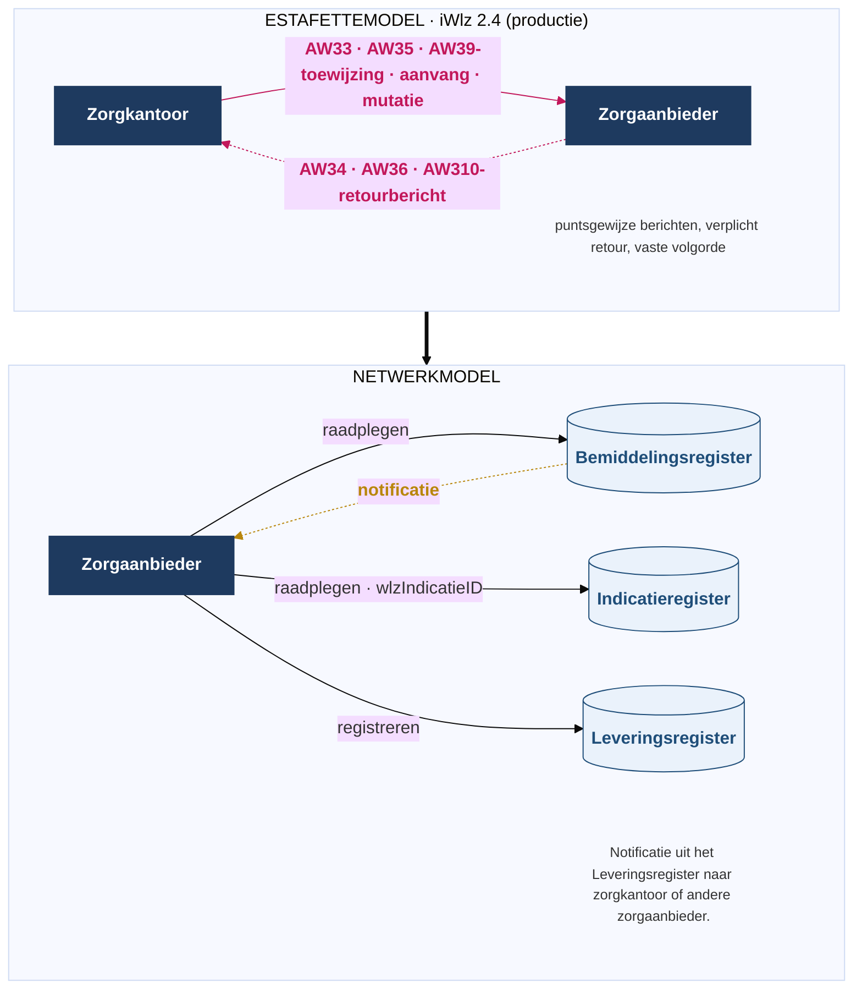

## 2. Wat verandert er voor de zorgaanbieder (en diens softwareleverancier)?

### 2.1 Van estafette naar netwerk

Vandaag werk je in het **estafettemodel** (iWlz 2.4 in productie). Daarin geven partijen berichten als een estafettestokje aan elkaar door, en elk inhoudelijk bericht kent een verplicht retourbericht:

- Het zorgkantoor stuurt je de toewijzing met **AW33** (retour **AW34**).
- Je meldt de aanvang van zorg met **AW35** (retour **AW36**).
- Je meldt mutaties en beëindiging met **AW39** (retour **AW310**).

In het **netwerkmodel** vervalt dit berichtenverkeer. In plaats daarvan staan actuele gegevens in registers die je raadpleegt als je daartoe geautoriseerd bent. Je ontvangt een notificatie over nieuwe of gewijzigde informatie, en je vult zelf het Leveringsregister.

Figuur 1 - Estafettemodel versus netwerkmodel: berichten met retour worden registers met notificaties

De procesveranderingen ten opzichte van het estafettemodel:

1. De AW33 vervalt. De toewijzingsinformatie staat in het Indicatie- en Bemiddelingsregister. De zorgaanbieder raadpleegt deze informatie. In plaats van de AW33 ontvangt de zorgaanbieder een notificatie.
2. De regiehouder (dossierhouder of coördinator zorg thuis) is actueel raadpleegbaar in het Bemiddelingsregister, inclusief tussentijdse wisselingen. In het estafettemodel zijn die tussentijdse wisselingen niet beschikbaar.
3. De informatieve zorgtoewijzing is raadpleegbaar. Het zorgkantoor verstuurt deze toewijzing niet meer automatisch.
4. Het retourbericht (AW34/AW36/AW310) vervalt: een bevestiging op de notificatie en foutmeldingen komen ervoor in de plaats (§3.10).
5. Het XML-bericht is vervangen door een GraphQL-query.
6. Contactgegevens van cliënt en contactpersonen zijn raadpleegbaar in het Bemiddelingsregister, en op termijn in het Leveringsregister.
7. Overlappende leveringen van andere aanbieders zijn met het Leveringsregister raadpleegbaar (LRA0005).
8. Bij een verzoek aan een andere aanbieder ontvangt die aanbieder een notificatie (`NIEUW_VERZOEKAANBIEDER_AANBIEDER`) en kan het verzoek raadplegen.
9. De zorgaanbieder in een andere regio dan het verantwoordelijk zorgkantoor raadpleegt direct de bron van het verantwoordelijk zorgkantoor, in plaats van via het uitvoerend zorgkantoor.

### 2.2 Inhoudelijke wijzigingen in het informatiemodel (los van de overstap op registers)

Naast de overstap van berichten naar registers wijzigen de volgende zaken inhoudelijk. De tabel hieronder vergelijkt estafette (iWlz 2.4) en netwerkmodel.

| **Onderwerp** | **Estafette (iWlz 2.4)** | **Netwerkmodel** |
| --- | --- | --- |
| Actualiteit van gegevens | AW33 is een volledige momentopname van alle geldige toewijzingen (OP087) | Registerstand, raadpleegbaar op het moment van bevraging |
| Bevestiging en foutafhandeling | Verplicht retourbericht (AW34/AW36/AW310) binnen één werkdag (OP090); alles-of-niets per cliënt (OP093); correctie binnen één werkdag (OP180) | Synchrone respons op de aanroep; bevestiging op de notificatie; foutmelding `IWLZFOUTMELDING` (§3.10) |
| Informatieve toewijzing | Broadcast van AW33 naar alle betrokken aanbieders, met informatieve toewijzingen (OP032, OP318) | Raadpleegbaar in het register; notificatie `INFORMATIEVE_BEMIDDELINGSPECIFICATIE_ZORGAANBIEDER` |
| Bovenregionaal verkeer | Doorstuurberichten tussen zorgkantoren (ZK33/ZK34, ZK35/ZK36, ZK39/ZK310) | Geen doorstuurberichten; raadpleging bij de bron van het verantwoordelijk zorgkantoor |
| Berichtspecifieke velden | `Mutatiecode`, `Mutatiedatum`, `Toewijzingstijd`, `StatusAanlevering` (correctiemechanisme OP033); `Etmalen`, `Sleuteldatum` | Vervallen of vervangen door registerstand en notificatie; `Etmalen` en `Sleuteldatum` kennen LR-equivalenten (`vaststellingMoment`, `sleuteldatum`) |

### 2.3 Gegevensmapping op hoofdlijnen

De gegevens uit je huidige AW-berichten verdelen zich over drie registers. Gebruik voor de exacte, veld-voor-veld vergelijking de mappingdocumentatie van iStandaarden.

| **Estafette-bericht** | **Belangrijkste inhoud** | **Netwerkmodel-bestemming** |
| --- | --- | --- |
| **AW33** (toewijzing, ZK → ZA) | Volledige cliënt-snapshot: `Client`, `Indicatie`, `Stoornis`, `Beperking`, `GeindiceerdZorgzwaartepakket`, `ToegewezenZorgzwaartepakket` (incl. `Dossierhouder`, `CoordinatorZorgThuis`) | Indicatiegegevens → **Indicatieregister** (WlzIndicatie); toewijzing/bemiddeling → **Bemiddelingsregister** (Bemiddeling, Bemiddelingspecificatie, Regiehouder) |
| **AW35** (aanvang, ZA → ZK) | `GeleverdZorgzwaartepakket`: `Begindatum`, `Sleuteldatum`, `Leveringsstatus`, `Etmalen`, `Behandeling` | **Leveringsregister** (Leveringperiode, Behandelingperiode) |
| **AW39** (mutatie/beëindiging + aanvraag, ZA → ZK) | `MutatieZorgzwaartepakket` (mutatie/einde, leveringsstatus) en `Aanvraag` + `AanvraagInstelling` (aanvraag aangepaste toewijzing) | **Leveringsregister** (Uitstelperiode, Afstel, Verzoek, VerzoekAanbieder) |
| **AW34 / AW36 / AW310** (retour) | Ontvangstbevestiging en retourcodes | Vervalt: bevestiging op de notificatie + foutmelding (§3.10) |

De officiële, gedetailleerde mapping voor de toewijzing is de Excel **"Mapping Bemiddelingsregister - AW33"** (versie 1.4.2, 19 juni 2025) bij de release [iWlz Bemiddelingsregister 1](https://www.istandaarden.nl/domain/iwlz/specificaties/release-1). Deze mapping beschrijft hoe de gegevens uit het Indicatieregister én het Bemiddelingsregister overeenkomen met de AW33. De mapping is gebaseerd op de GraphQL-koppelvlakken Indicatieregister 1.4 en Bemiddelingsregister 1.1.0 en de AW33-schemadefinitie (iWlz 2.4.3).

!!!info
    De AW33-mapping dekt **beide** registers. Het tabblad AW33 bevat een kolom "Register" die elk AW33-veld toewijst aan het Indicatieregister of het Bemiddelingsregister. In versie 1.4.2 mapt de mapping circa 78 velden naar het **Indicatieregister** (waaronder alle BRP-cliëntgegevens, en het cliëntadres en telefoon) en circa 57 naar het **Bemiddelingsregister** (waaronder contactpersonen, regiehouder en de toewijzing zelf). Je hoeft dus geen aparte indicatie-mapping te maken: het Indicatieregister zit al in dit bestand, en is qua omvang zelfs de grootste bron. De twee uitgangspunten in de mapping: BRP-cliëntgegevens komen uit het Indicatieregister. Contactinformatie van de cliënt en relatiegegevens komen uit het Bemiddelingsregister. Het `wlzIndicatieID` blijft daarnaast het sleutelveld waarmee je vanuit het Bemiddelingsregister de actuele indicatie-inhoud in het Indicatieregister raadpleegt (zie §3.7).

### 2.4 Samenvatting van de benodigde aanpassingen

Hieronder staat wat een softwareleverancier aanpast of bouwt, met verwijzing naar de stappen in hoofdstuk 3. Dit is de volledige scope, niet alleen het wegvallen van de berichten.

- **Aansluiten.** VECOZO-aansluiting, systeemcertificaten (test en productie), IP-registratie, en endpoint-registratie in het tijdelijk adresboek (§3.2, §3.3, §3.4).
- **Autoriseren.** Tokens aanvragen namens de zorgaanbieder op AGB-basis (actor), met de juiste scopes en audience; al het verkeer loopt via de PEP (§3.5).
- **Notificaties ontvangen.** Een resource-endpoint voor notificaties uit het Bemiddelingsregister, en op termijn uit het Leveringsregister (§3.6.1).
- **Raadplegen.** Een GraphQL-client voor de keten Bemiddelingsregister -> `wlzIndicatieID` -> Indicatieregister, conform de query-templates en GraphQL-over-HTTP (§3.7).
- **Leveringsregister vullen en notificeren.** De zorglevering registreren en de bijbehorende notificaties versturen (§3.6.2, §3.8, §3.9).
- **Melden.** Foutmeldingen afhandelen; alleen de bronhouder registreert een melding-endpoint (§3.6.3).
- **Foutafhandeling.** Synchrone respons en foutmelding in plaats van het retourbericht (§3.10).
- **Tracelogging.** `X-B3-TraceId` en `X-B3-SpanId` conform RFC0022a (§3.11).
- **Testen.** Testomgeving, testcertificaat, fictieve BSN's en een onboarding-testdataset (§4).
- **Berichten uitfaseren.** Genereren en verwerken van AW33/AW34, AW35/AW36 en AW39/AW310 vervalt. Let op de overgangsfase: zolang niet alle aanbieders zijn aangesloten, blijft [Silvester](https://istandaarden.github.io/Afsprakenstelsel-iWlz/current/applicatie/silvester/) voor niet-aangesloten partijen AW33-berichten genereren (§2.1, §3.1).